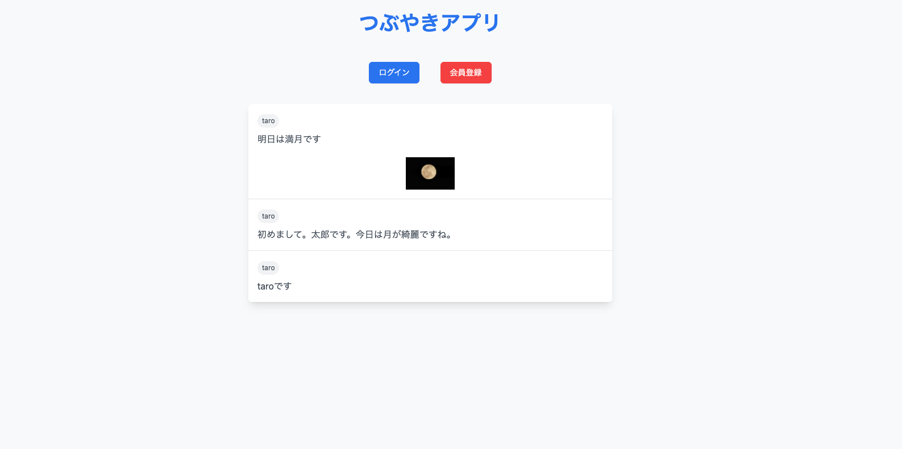
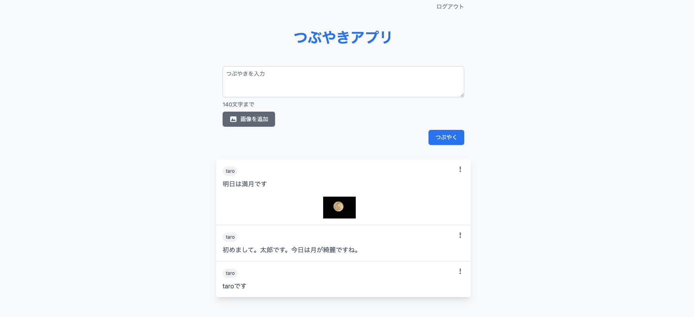
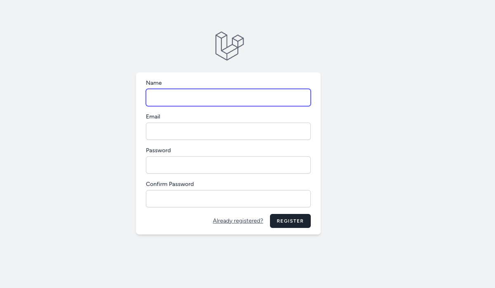
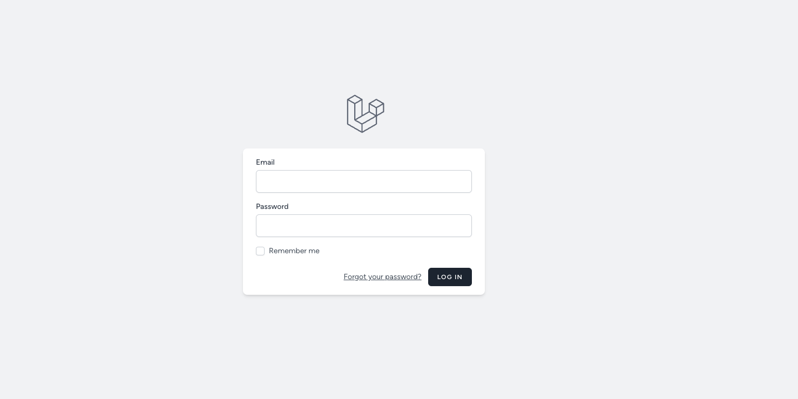
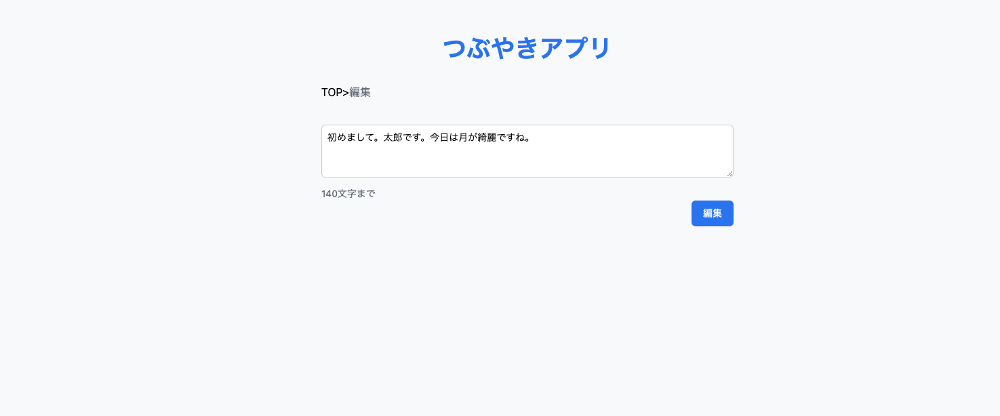

# TWEETER風アプリ

 これはlaravelで作成されたWebアプリケーションです。
Tweeter風のつぶやきアプリです。ユーザーがつぶやきを投稿し、他のユーザーのつぶやきを閲覧できる機能を提供します。

# 主なページと機能 

|　TOPページ  | 投稿ページ |
| ---- | ---- |
| | |
| topページです。会員登録してから投稿ができます。 | 投稿ページと投稿一覧ページです。ここから投稿ができます。また投稿、削除ができます。 |

| ユーザ登録ページ | ログインページ |
| ---- | ---- |
| | |
| ゲストはユーザー登録することで質問や回答を投稿することができます。 | ユーザーは登録ページで登録したメールアドレスとパスワードを入力することでログインすることができます。ヘッダーのログアウトボタンでログアウトすることができます |

| 編集ページ |
| ---- |
| |
| 自分の投稿を編集することができます。 | 

# 使用している技術
* larevel
* tailwindcss
* HTML&CSS
* MySQL
* docker

# 環境構築
https://laravel-app-tweet-315679037f73.herokuapp.com/tweet へアクセスします。
会員登録を行い、投稿をしたり閲覧したりします。

# 作成者 

* uheiji
